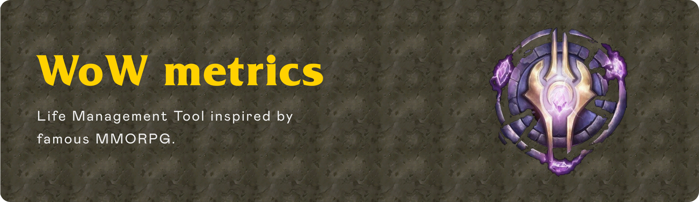
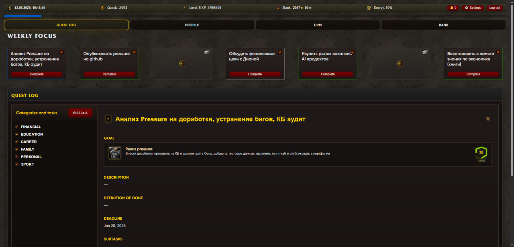
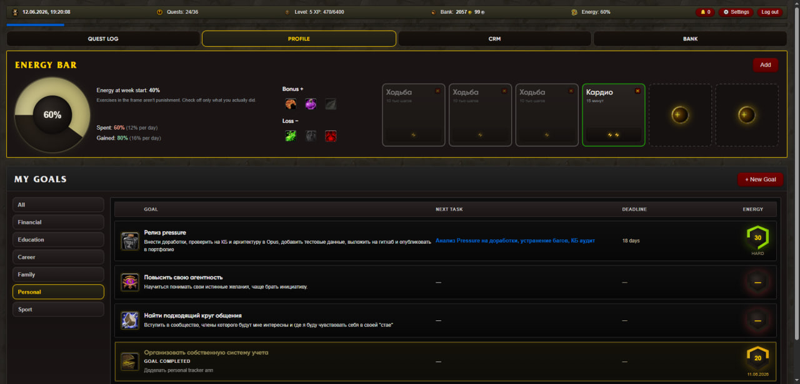
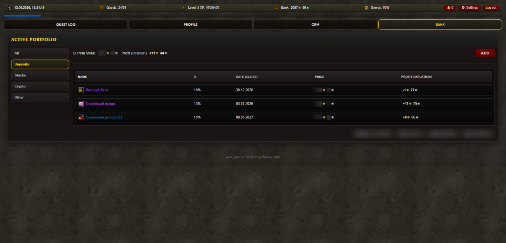

  
  
  <h1>⚔️ wow_metrics</h1>
  
<strong>Gamified Personal Management System inspired by World of Warcraft</strong>

  
<strong>Author:</strong> Yury Mikhno

  

---

**wow_metrics** is a powerful Life Management Tool stylized with the popular MMORPG World of Warcraft interface. The application combines task management, financial tracking, energy control, and contact management (CRM) with gamification elements: earn experience, level up, and monitor your "Energy" bar.

## 🚀 Quick Start

Installation and launching are maximally simplified for Windows users and take just a few clicks.

**IMPORTANT:** To install the application, you must download the `wow_metrics_windows.rar` file from the [Releases](https://github.com/Duneholy/wow-metrics/releases) section of this repository.

### 1. Installation
1. Download and extract the `wow_metrics_windows.rar` archive.
2. Double-click on **`Install wow_metrics.bat`** (the window won't close automatically; if there's an error, check `install.log`).

**Node.js** is installed automatically if it's not present on your PC (first using `winget`, then by downloading the LTS version from nodejs.org). If you encounter permission errors: right-click on **`Install wow_metrics.bat`** → **Run as administrator**.
This script will:
- Check for Node.js (and automatically attempt to install it if missing).
- Install all necessary dependencies for Frontend and Backend.
- Automatically setup and prepare the SQLite database.

*Note: If the script installed Node.js itself, you will need to close the console and run `install.bat` again.*

### 2. Launching the App
Double-click on **`Launch wow_metrics.bat`** (or the shortcut).
This script will completely hide the terminals and automatically open the application in your favorite browser (`http://localhost:5173`).

*(To completely stop the tracker, run the **`Stop wow_metrics.bat`** file).*

**`setup.bat`** (optional) — builds the production version: a single server at `http://localhost:4000` without Vite. For normal usage, `install.bat` + `Launch wow_metrics.bat` is sufficient.

---

## ✨ Key Features

  

### 📜 Quest Log
- **Goals and Quests:** Set global goals and break them down into subtasks of varying difficulty (Easy, Medium, Hard, Epic).
- **Gamification:** Every completed quest grants **XP** (Experience). Fill your experience bar to gain new Levels.
- **Weekly Focus:** A convenient sprint planning mechanism — Drag-and-Drop your 7 main quests into the current week's slots.

  

### ⚡ Energy Bar
- A dynamic system for calculating your personal effectiveness. You lose energy daily (configurable in profile).
- Restore energy by completing habits and workouts ("Exercises").
- Features negative and positive modifiers (Bonus & Loss) that affect your overall energy tone.

  

### 💰 Bank and Assets
- Multi-currency tracking of fiat funds and financial assets.
- **Exchange Integration:** Automatically fetches current and historical prices for cryptocurrencies (CoinGecko API) and stocks (MOEX).
- **Inflation Calculation:** Accounts for capital depreciation based on a specified inflation percentage.

### 🍻 Tavern / Contacts (CRM / Networking)
- A personal contact base for networking.
- Sort by the date of the last contact or birthday.
- Touches tracking — see who you haven't talked to in a while and plan meetings ("Quests" from the Quest Log can be linked to specific people).

---

## 🛠 Technology Stack

**Frontend:**
- **React 18** — library for building UI
- **Vite** — fast project bundler
- **TypeScript** — strict typing
- **Vanilla CSS** — completely custom styles, animations, and WoW-style cursors (no Tailwind).

**Backend:**
- **Node.js + Express** — server logic and REST API
- **Prisma ORM** — modern and safe ORM
- **SQLite** — lightweight file database (ideal for personal use)
- **Zod** — schema and data validation
- **Bcrypt / JWT** — authorization and security

---

## 🎨 Design and Authenticity
The entire project is imbued with the atmosphere of World of Warcraft:
- Custom game cursors (including hover and drag animations).
- Unique panel textures, skill borders, and icons.
- Gamified fonts (`FRIZQT`, `Morpheus`, `Skurri`).
- Dark Mode styling by default.

---

## 🤝 Contributing
The project is under active development. If you want to contribute:
1. Fork the repository.
2. Create a branch for your feature (`git checkout -b feature/AmazingFeature`).
3. Commit the changes (`git commit -m 'Add some AmazingFeature'`).
4. Push the branch to origin (`git push origin feature/AmazingFeature`).
5. Open a Pull Request.

---

## 📄 License and Disclaimer

This project is distributed under the **MIT** license — see the [LICENSE](LICENSE) file.

World of Warcraft style visual assets: see [DISCLAIMER.md](DISCLAIMER.md) (this project is not affiliated with Blizzard Entertainment).
